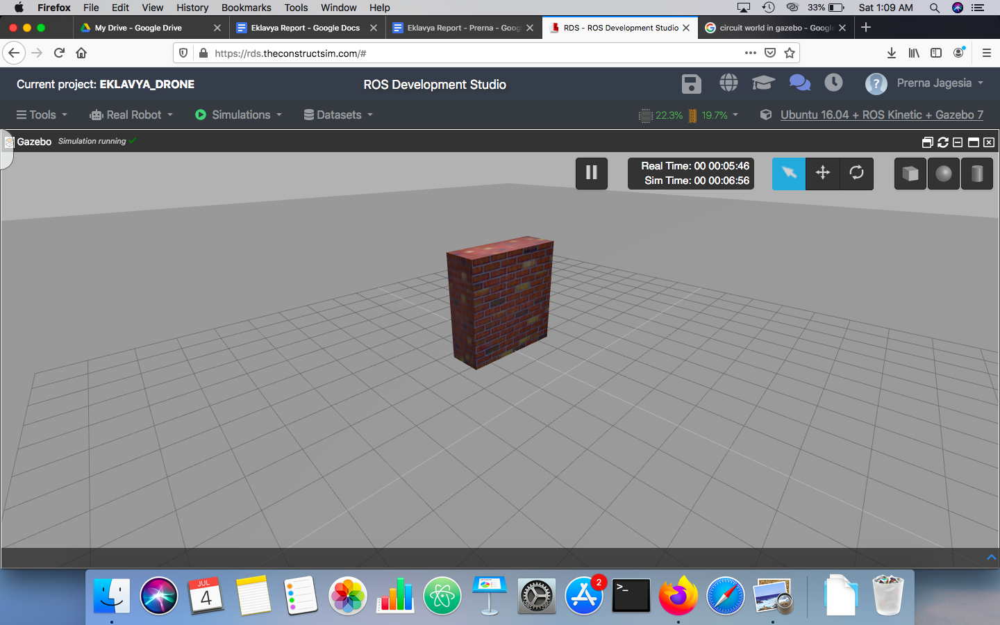
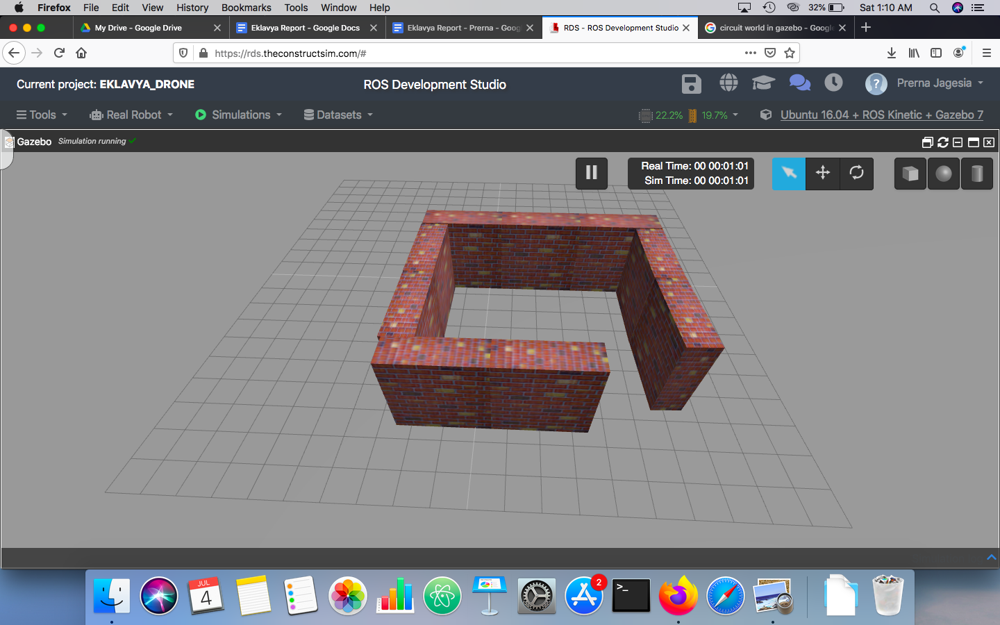

# Eklavya20-Drone

# DRONE SIMULATION PROJECT
Simulated drone model which flies to a given destination along with obstacle avoidance. 

## TABLE OF CONTENTS
   * [About the Project](#about-the-project)
   
     [Tech Stack](#tech-stack)
   
     [File Structure](#file-structure)
     
   * [Getting Started](#getting-started)
     
     [Prerequisites](#prerequisites)
     
     [Installation](#installation)
   
   * [Usage](#usage)
   
   * [Results and Demo](#results-and-demo)
   
   * [Future Work](#future-work)
   
   * [Troubleshooting and Errors](#troubleshooting-and-errors-)
   
   * [Contributors](#contributors)
   
   * [Acknowledgements and Resources](#acknowledgement-and-resources)
   
   * [License](#License)

##  ABOUT THE PROJECT
GOALS WE AIM TO ACHIEVE :-
We aim to achieve obstacle avoidance and flying of a drone from one destination to another by simulating our drone.

## TECH STACK

[ROS](http://wiki.ros.org/Documentation)

[GAZEBO](http://gazebosim.org/)
## FILE STRUCTURE
```
.
└── src                            # Source Files
|   +--obstacle_avd.py            # Integrated goal-to-goal with obstacle avoidance
|    +--goal.py                   # Performs only goal-to-goal
├── EKLAVYA FINAL REPORT 2020.pdf  # Project Report
├── goal_to_goal.mp4               # Video showing only goal-to-goal with reduced speed and more accuracy
├── goal_to_goal_1.mp4             # Video showing only goal-to-goal with increased speed and less accuracy
├── README.md
└── LICENSE.md

```
 ##  GETTING STARTED:
 
 ## PREREQUISITES:
 
 1.ROS Installed:
 
   To install ROS, visit the following link: http://wiki.ros.org/ROS/Installation
   We have used ROS Kinetic distro.
    
 2. Gazebo Installed:
 
    To install Gazebo, visit the following link: http://gazebosim.org/tutorials?tut=install_ubuntu 
    We have used gazebo 7.
    
 3. You can also use ROS Development Studio instead of instaliing ROS AND Gazebo.
 
    To get started with RDS, visit the following link: https://rds.theconstructsim.com 
 
## INSTALLATION:
 
 1. Clone the repository.

  ``` 
  git clone https://github.com/pkjagesia/Eklavya20-Drone.git 
  
  ```

## USAGE:
 
 To use our project:
 
 Clone our hector_quadrotor model using the following command:
 
 ```
 git clone https://bitbucket.org/theconstructcore/hector_quadrotor_sim.git
 ```
 
 
 Open the desired world in gazebo simulator. Then run the following commands:
 ```
 roslaunch hector_quadrotor_demo put_robot_in_world.launch
 rosrun simple_controller obstacle_avd.py
 ```
##   RESULTS AND DEMO
Images of worlds in which we have tested:







![Circuit] (Circuit.png)


[Here](https://drive.google.com/drive/folders/1nxyV9tvf0r-nfA7F3ttJ98836h8-ajW_?usp=sharing) are the videos of our project

## FUTURE WORK
1. Our first step is to integrate obstacle avoidance and the code which we have written 
for the drone to move from one destination to another within an environment of four walls .

 2. Our second step would be to implement obstacle detection code with obstacle avoidance as 
this would be a great aid for the drone to perform then future tasks like geography mapping  ,
aerial photography without having to worry about obstacles in its way.

3. We aim to achieve our goal of obstacle detection through contour detection.
Contour detection is based on detecting the outline of the object within the environment. It is preferred because it is based upon edge detection, which has been optimized in run time and complexity, therefore, allowing for near real-time run implementations.

4. We aim to expand on our avoidance goal in the near future by implementing SLAM,so the quadrotor can create a map of the environment it is navigating. When this path is to be chosen, a stereo camera can be mounted to the quadrotor for distance estimation. Supporting this, LiDAR can also be used, and the data acquired by the system can be processed and fused for a detection algorithm.
These are our future aspects of the project.

## TROUBLESHOOTING AND ERRORS:-
Error #1

TERM|DETAIL
----|------
Problem |The laserscan data was giving error values
Cause|It was detecting the landing gear of the drone
Solution|Changed the minimum range of detection from 0.08 to 0.1

Error #2

TERM|DETAIL
----|------
Problem |Code gave an error of "syntax error near unexpected token `(`"
Cause|It could not find it's dependencies and libraries in CMakeLists.txt
Solution|Added add_depndencies line and libraries required to make file executable

Error #3

TERM|DETAIL
----|------
Problem|The messages for the drone to move forward were not getting published
Cause|It takes sometime for the subscriber node to subscribe to a given topic , until then the messages being published are lost
Solution|Used the get_num_connections() function to publish messages only when the subscribers become available.

Error #4

TERM|DETAIL
----|-------
Problem|The corners were not getting detected accurately
Cause|The Rate at which the loop was running was comparatively slow but appropriate
Solution|Modified the logic for detecting corners

Error #5

TERM|DETAIL
----|------
Problem|	The algorithm for goal to goal was not suitable for integrating with obstacle avoidance
Cause|Obstacle avoidance algo used left-right turns and goal-to-goal used oblique turns
Solution|Changed the algorithm for goal-to-goal to consist of left-right turns

## CONTRIBUTORS
* MENTORS
   1. Neha Kurian 
   2. Mr.Omkar Sargar
   3. Mr.Lukesh
 * MEMBERS
 
   1.[Ms.Prerna Jagesia](https://github.com/pkjagesia)
   
   2.[Ms.Prachiti Barge](https://github.com/Prachiti-tech)
   
   3.[Samina Attari](https://github.com/SaminaAttari786)
   
   4.[Khushi Barjatia](https://github.com/khushibarjatia)
   
## ACKNOWLEDGEMENT AND RESOURCES
* [SRA VJTI](http://sra.vjti.info/) Eklavya 2020
* [Obstacle avoidance algorithm](https://link.springer.com/chapter/10.1007/978-3-319-62533-1_7)
* [ROS TUTORIALS](http://wiki.ros.org/ROS/Tutorials)
* [Gazebo tutorials](http://gazebosim.org/tutorials)

## LICENSE


[](https://opensource.org/licenses/MIT)

Licensed under the [MIT License (MIT)](LICENSE.md) .

Copyright(c) 2020 Prerna Jagesia,Prachiti Barge,Samina Attari and Khushi Barjatia
